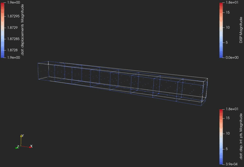
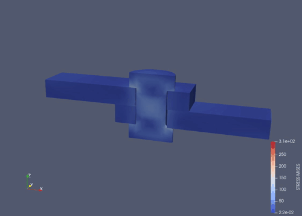
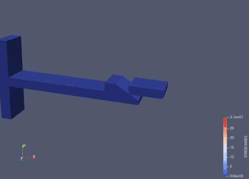
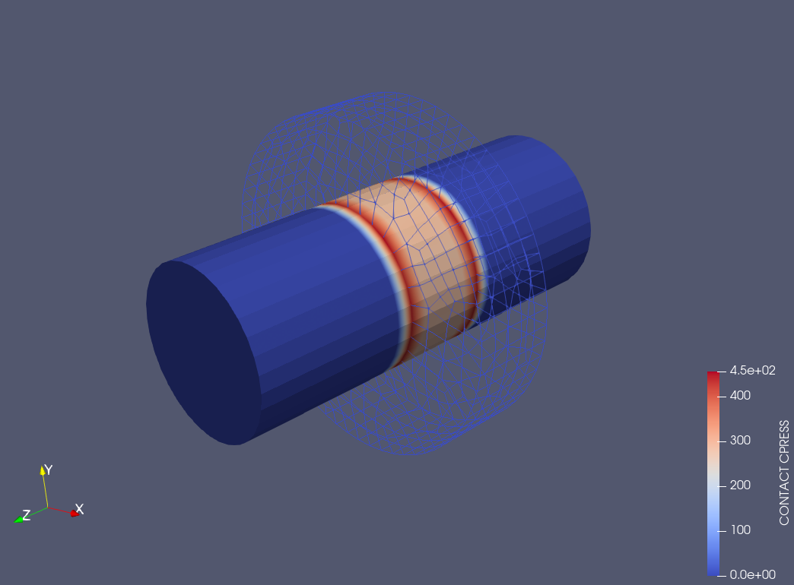
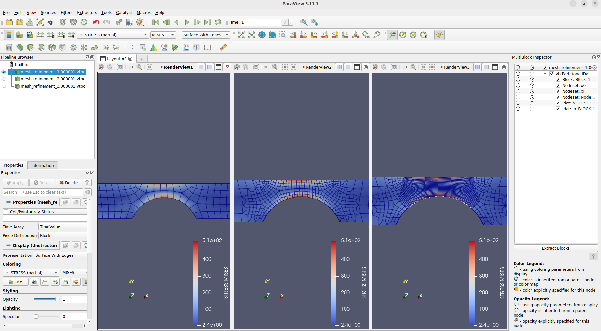
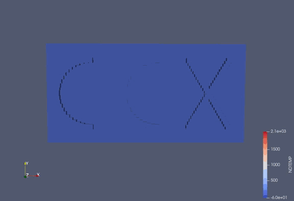
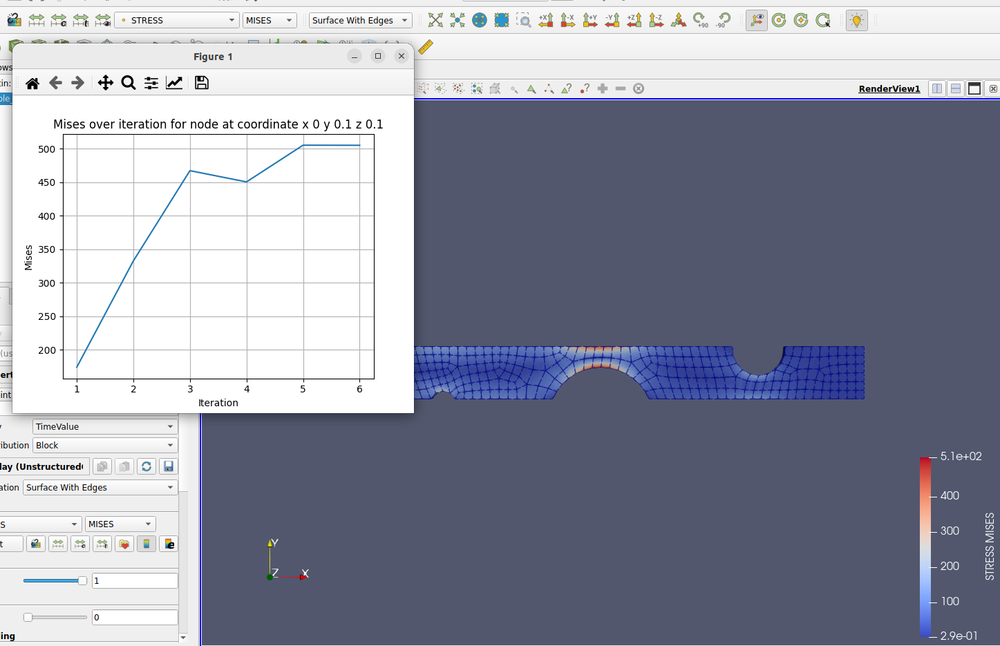
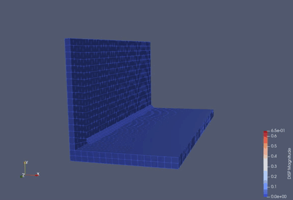

# Cubit-CalculiX 2024.9
Hey ho that´s the CalculiX Component for coreform cubit!

Full Model definitions for CalculiX can be done with Cubit as Preprocessor.
After the run with CalculiX the results will be automatically converted for Paraview.

Here you can find the source code.

The builds can be downloaded at our [website](https://www.maschinenbauer.at/open-source/calculix-component-for-coreform-cubit).

Or just use the links.

[Windows Build](https://www.maschinenbauer.at/upload/build-windows-2024-9.zip)
[Linux Build](https://www.maschinenbauer.at/upload/build-linux-2024-9.zip)

This component was build with Cubit 2024.8! 

Tested with Cubit 2024.8 on Windows 10 and Ubuntu 22.04

# Key Features
Definition of:
- Elements Sets
- Node Sets
- Side Sets
- Materials (Conductivity, Density, Elastic, Expansion, Plastic, Specific Heat)
- Sections (Solid, Shell, Membrane, Beam)
- Constraints (Tie, Rigid Body)
- Surface Interactions
- Contact Pairs
- Amplitudes
- Orientations
- Loads (CLOAD, DLOAD, DFLUX, GRAVITY, CENTRIF)
- Boundary Conditions (Displacements, Temperatures)
- Initial Conditions (Displacements, Temperatures)
- History Outputs (NODE PRINT, EL PRINT, CONTACT PRINT)
- Field Outputs (NODE FILE, EL FILE, CONTACT FILE)
- STEPS (Static, Frequency, Buckle, Heat Transfer, Coupled Temperature Displacement, Uncoupled Temperature Displacement, No Analysis)
- Adding Customlines before/after Keywords
- Export of Calculix Model
- Creation and Running of Jobs
- Conversion of Results to Paraview (.frd and .dat: nodal, element and integration points results, auto calculating von Mises and Principal Stresses)
- Projection of Displacements from .frd to mesh
- Opening of Results with CGX or Paraview
- Results can be viewed, plotted and exported to .csv
- Displaying of loads and boundary conditions
- Python Interface to query the result files. This can be used to run convergence studies or do mesh refinement based on the results. 

# How to
To get an overview of all new commands type

ccx ?

in cubit mode (#!cubit)

For the functions of the python interface type

ccx.help()

in python mode (#!python)

# Examples

# Installation

Download the build directory and point within Cubit to the Directory.

- Tools->Plugins->Add

Restart Cubit.

The Cubit Window should now show "Coreform Cubit 202x.x -- with CalculiX" in the Title.

Now just enable the Model Tree

- View->CalculiX Model Tree

Try to open and run the journal file "first_run.jou"

If everything works. It should compute a beam and automatically open the results with cgx and paraview.

# Postprocessing

After the run with CalculiX the results should be loaded and converted automatically. If a Job exited with errors you can try to convert it over the Button in the Job Monitor.

The mises stresses and strains will be precalculated for the S and E keys.
If the preprocessing was done in cubit and the results can be linked. Then the data from the .frd and .dat can be viewed with paraview. When the linking fails, the .frd will be converted to vtu.
In paraview you can see the linked and computed results with the multiblock inspector.

If integration point data was requested in the .dat, the converter computes the location of the integration points and links the results. The integration point number and the element id can be queried with paraview. The element id can be found in the cell data. The ip number in the point data.

When there are displacements in the frd file for requested blocks in the .dat. The displacements of the integration points will also be computed.

current limitations of the converter:
- totals ignored
- buckling in .dat ignored
- contact print card ignored
- only links for complete nodal and element data

# Projection of Displacements

with the command "ccx result project job 'job_id' {step 'step' | totalincrement 'totalincrement'} [scale 'scale']"

The displacements from an .frd can be scaled and projected to the nodes in cubit. It has to be .frd where the mesh is ident with the one in cubit.
Otherwise linking fails and no projection will be done. If a step is choosen, it will project the last available increment with displacement data.
When choosing the totalincrement the related displacements will be used.

# known issues
- Can not open results for Paraview 5.12.0 out of Cubit. Please use Paraview 5.11.* or a new Version with a fix. See https://gitlab.kitware.com/paraview/paraview/-/issues/22614

- History Bug on Windows: Currently commands that will be send using the gui won't be recorded into the history tab. This has been fixed for Linux. In the current windows release (2024.8) are some symbols missing. So we have to wait onto the next release to fix this for windows too.

# todo list
- documentation
