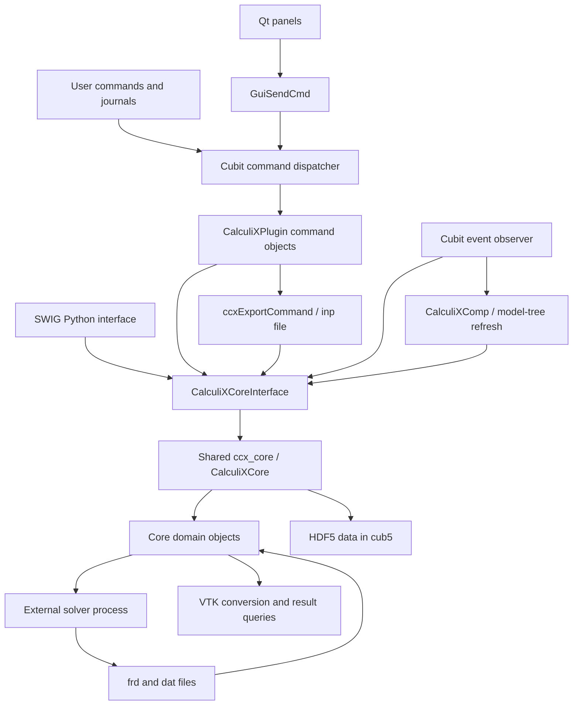

# Architecture overview

[Developer documentation](README.md)

## Runtime structure

Cubit-CalculiX is a Cubit extension with command, GUI, shared model, and Python binding layers. Cubit supplies host services such as mesh access, command execution, and file-event notifications. CalculiX runs as an external solver.

The following diagram summarizes calls observed in the source. It is a navigation aid, not an exhaustive dependency graph.

## Entry points and shared state

- [CalculiXPlugin.cpp](../src/CalculiXPlugin.cpp) registers the command plugin with `CUBIT_PLUGIN`, lists command keys in `get_keys()`, and constructs command objects in `create_command()`. Its constructor calls `ccx_core.init2()`.
- [loadCalculiXComp.cpp](../src/loadCalculiXComp.cpp) registers the GUI component. [CalculiXComp.cpp](../src/CalculiXComp.cpp), `start_up()`, restores settings, creates command panels before the docked model tree when GUI mode is enabled, and installs observers. Some menu, toolbar, and export-manager setup calls are commented out; their files alone do not establish active functionality.
- [loadCalculiXCore.cpp](../src/Core/loadCalculiXCore.cpp) defines one global `CalculiXCore ccx_core`. [CalculiXCoreInterface.cpp](../src/Core/CalculiXCoreInterface.cpp) forwards operations to this shared instance. Constructing an interface does not create an independent model.
- [CalculiXCore.cpp](../src/Core/CalculiXCore.cpp) allocates domain objects in `init()` and deletes them in its destructor. `init2()` obtains Cubit mesh-export and material interfaces and initializes additional material state. `init_pythoninterface()` sends Python commands to create the `ccx` Python object.

The core depends on Cubit and Qt: it is not a standalone solver or a host-independent data library. See the `calculix_core` link dependencies in [CMakeLists.txt](../src/CMakeLists.txt).

## Commands, GUI, and model updates

Commands define syntax, help, and an `execute(CubitCommandData&)` method. For example, [ccxDampingModifyCommand.cpp](../src/Commands/ccxDampingModifyCommand.cpp) reads optional alpha/beta values, converts numbers to strings, and passes values plus presence markers through the core interface.

[DampingModifyPanel.cpp](../src/GUI/DampingModifyPanel.cpp) constructs the same command text. [GuiSendCmd.cpp](../src/GUI/GuiSendCmd.cpp), `gui_cmd()`, calls `CubitInterface::cmd()` and appends the command to the GUI history widget. This verifies the command route for this panel; do not assume every GUI action uses it.

[Observer.cpp](../src/EventObservers/Observer.cpp) connects host events to the model:

- `notify_command_complete()` calls `core_update()` unless blocked and refreshes the GUI immediately or through a timer, subject to update flags.
- `notify_model_reset()` resets both the core and component view.
- File-read and file-save notifications call the persistence methods. Temporary file saves are explicitly skipped.

Tree display data also passes through the interface. For damping, `CalculiXCore::get_damping_tree_data()` constructs ID/name rows consumed by [DampingTree.cpp](../src/GUI/DampingTree.cpp).

## Model representation and persistence

Domain objects such as `CoreSections`, `CoreSteps`, and `CoreDamping` hold feature state. Many interfaces use positional vectors rather than named record fields. For example, [CoreDamping.hpp](../src/Core/CoreDamping.hpp) defines `damping_data[0]` as alpha and `[1]` as beta. Empty strings represent unset coefficients; an explicit zero is a different stored value.

`CalculiXCore::read_cub()` and `save_cub()` use [HDF5Tool](../src/Utility/HDF5Tool.hpp) to read/write groups beneath `Cubit-CalculiX` in the model file. Damping uses the rank-one string dataset `Cubit-CalculiX/Damping/damping_data`. The reader rejects the legacy `.cub` extension and directs users to `.cub5`.

Changing vector layout is therefore potentially a file-format change. Check initialization, reset, readers, writers, display consumers, and exports together. The damping reader fills two empty entries when its dataset is empty; that is not proof of a general migration mechanism.

## Export, solving, and results

[ccxExportCommand.cpp](../src/Commands/ccxExportCommand.cpp) orchestrates `.inp` output: preparation, mesh nodes/connectivity and sets, model keyword sections, steps, and cleanup. It combines Cubit mesh-export access with core-generated keyword text. For example, `write_damping()` writes `get_damping_export_data()`.

[CoreDamping.cpp](../src/Core/CoreDamping.cpp), `get_damping_export_data()`, emits `*DAMPING` when at least one coefficient is set, appends the set parameters, and includes custom lines before/after the keyword. [CoreSteps.cpp](../src/Core/CoreSteps.cpp) is a separate inspection point for step-dependent features.

[CoreJobs.cpp](../src/Core/CoreJobs.cpp) creates/manages jobs, starts external processes in `run_job()`, waits or kills them, and checks completion in `check_jobs()`. Windows and non-Windows process handling have separate branches. Completion handling includes result loading and conditional conversion.

[CoreResults.cpp](../src/Core/CoreResults.cpp) maintains job-to-result associations, loads FRD/DAT readers, and creates a `CoreResultsVtkWriter` for conversion. Result reading and conversion live in separate `CoreResultsFrd`, `CoreResultsDat`, and `CoreResultsVtkWriter` files. Python query methods in [CalculiXPythonInterface.cpp](../src/PythonInterface/CalculiXPythonInterface.cpp) forward through the same core interface.

For a complete step-dependent feature trace, see the [surface-traction walkthrough](adding-a-feature.md), including its conversion from distributed total force components to nodal `*CLOAD` entries.
